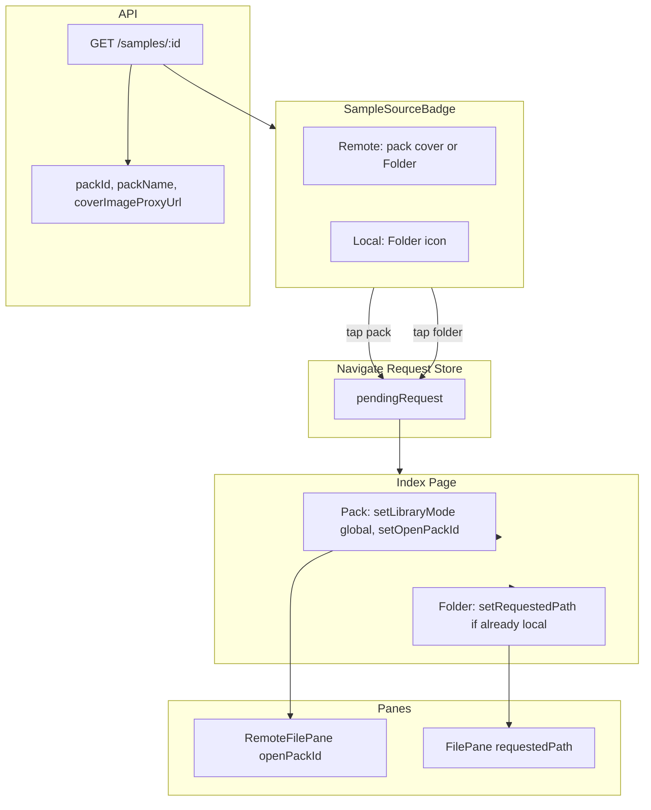

# Sample Source Navigation

Architecture for showing sample filenames with pack/folder icons and navigating to the sample's source (global pack, local pack, or folder).

## Overview

Samples can come from:

- **Global packs**: Remote samples from the server (`remote://sample/{id}`)
- **Local packs/folders**: Files from the user's file system (source or destination pane)

The Sample Source Badge shows where a sample came from and lets users navigate there.

## Components

### SampleSourceBadge

Reusable component (`src/components/SampleSourceBadge.tsx`) that displays:

- **Remote samples**: Pack cover thumbnail (or `Folder` icon if no pack)
- **Local samples**: `Folder` icon

Props: `source` (remote or local), `filename`, `size` (sm/md), `showFilename`, `useLink`, `packId`.

Helper: `sampleSourceFromPath(path, paneType)` builds a `SampleSource` from a stack sample path.

### Navigate Request Store

Zustand store (`src/stores/navigate-request-store.ts`) for requesting navigation without prop drilling:

```ts
type NavigateRequest =
  | { type: "pack"; packId: string }
  | { type: "folder"; path: string; paneType: "source" | "dest" }
  | null;
```

- `requestNavigate(req)` – set pending request
- `clearRequest()` – clear after handling
- `pendingRequest` – current request (Index subscribes)

### API

`GET /api/library/samples/:id` returns `id`, `name`, and optionally `packId`, `packName`, `coverImageProxyUrl` when the sample belongs to a pack.

## Consumers

| Location | Behavior |
|----------|----------|
| **Queue dashboard** | JobCard shows filename + pack icon. Uses `Link` to `/?openPack={id}` for cross-page navigation. |
| **Cache debug view** | CacheCard shows filename + pack icon. Uses store for same-page navigation. |
| **Stack blocks** | MultiSampleBlock header shows pack/folder icon + filename. Uses store for same-page navigation. |

## Navigation Rules

Handled in `src/pages/Index.tsx`:

| Action | Behavior |
|--------|----------|
| **Pack icon** | Switch to global mode and open the pack. OK to switch because the user can always see the server. |
| **Folder icon** | Navigate to folder only when already in local mode. Do not switch from global to local (user may not have a folder selected). |
| **URL `?openPack={id}`** | Switch to global mode, open pack, clear search param. Used when arriving from Admin Queue dashboard. |

## Data Flow



## Key Files

| File | Purpose |
|------|---------|
| `server/routes/library.ts` | Sample endpoint with pack info |
| `src/lib/remote-library.ts` | `getSample()`, `SampleWithPack` type |
| `src/stores/navigate-request-store.ts` | Navigation request store |
| `src/components/SampleSourceBadge.tsx` | Badge component |
| `src/pages/Index.tsx` | Handles store + URL param |
| `src/components/RemoteFilePane.tsx` | `openPackId` prop |
| `routes/index.tsx` | `openPack` search param |
